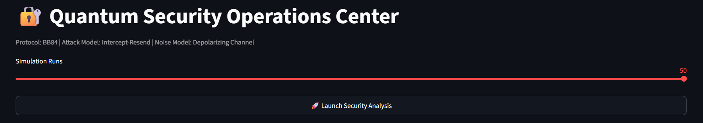

# 🔐 Quantum Secure Communication Simulator

A Quantum Key Distribution (QKD) simulator implementing the **BB84 Protocol** using **Qiskit**, featuring eavesdropping detection, quantum noise modeling, Quantum Bit Error Rate (QBER) analysis, and an interactive Security Operations Center (SOC) dashboard.

---

## Overview

Quantum cryptography enables secure communication by leveraging the principles of quantum mechanics. This project implements the BB84 Quantum Key Distribution protocol and demonstrates how an eavesdropper (Eve) can be detected through increases in Quantum Bit Error Rate (QBER).

The simulator models:

* Secure BB84 communication
* Intercept-Resend attacks
* Quantum channel noise
* Attack detection through QBER
* Statistical security validation
* Real-time monitoring dashboard

---

## Features

### BB84 Quantum Key Distribution

* Alice and Bob generate secure shared keys
* Random basis selection
* Key sifting process

### Eavesdropping Detection

* Intercept-Resend attack simulation
* Eve measurement disturbance modeling
* Automatic attack detection

### Quantum Noise Modeling

* Depolarizing channel simulation
* Noise-only communication scenarios
* Combined attack + noise analysis

### Security Analytics

* Quantum Bit Error Rate (QBER) computation
* Multi-run statistical validation
* Security threshold monitoring

### SOC Dashboard

* Threat monitoring interface
* QBER trend analysis
* Attack risk gauge
* Distribution analysis
* Research validation panel

---

## Technology Stack

* Python
* Qiskit
* Streamlit
* Plotly
* NumPy
* Pandas
* Matplotlib

---

## Experimental Results

| Scenario    | Average QBER |
| ----------- | ------------ |
| No Eve      | ~0%          |
| Noise Only  | ~5%          |
| Eve Attack  | ~25%         |
| Eve + Noise | ~28%         |

The observed results closely match theoretical BB84 predictions, validating the correctness of the implementation.

---

## Dashboard Preview

### Quantum Security Operations Center



---

## Project Structure

```text
Quantum-Secure-Communication-Simulator/
│
├── src/
│   ├── alice.py
│   ├── bob.py
│   ├── eve.py
│   ├── qber.py
│   ├── simulation_runner.py
│   └── ...
│
├── assets/
├── results/
├── dashboard.py
├── main.py
├── research_analysis.py
├── requirements.txt
└── README.md
```

---

## Installation

```bash
git clone https://github.com/sambhavxd/Quantum-Secure-Communication-Simulator.git

cd Quantum-Secure-Communication-Simulator

pip install -r requirements.txt
```

---

## Run Dashboard

```bash
streamlit run dashboard.py
```

---

## Research Areas

* Quantum Cryptography
* Quantum Communication
* Quantum Key Distribution (QKD)
* BB84 Protocol
* Quantum Information Security
* Quantum Computing

---

## Author

**Sambhav Jha**

Electronics and Communication Engineering
SRM Institute of Science and Technology

Research Interests:

* Quantum Computing
* Quantum GPS
* Quantum Navigation
* Quantum Cryptography
* VLSI Design
